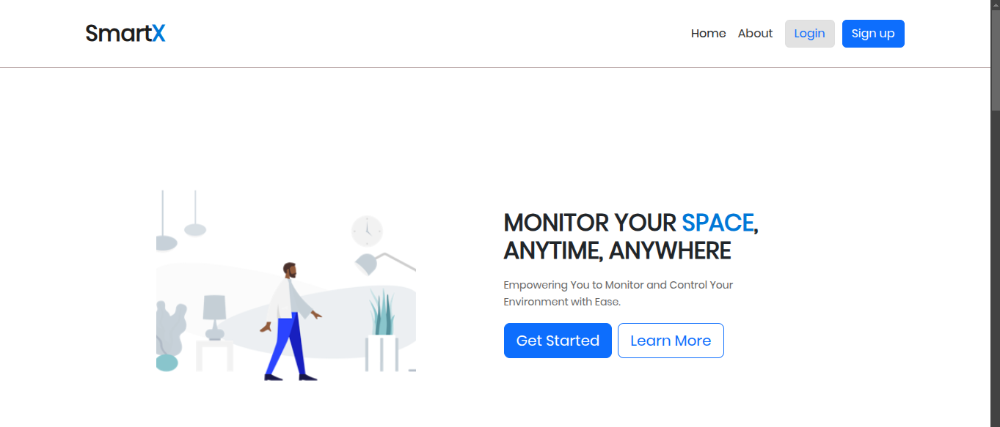
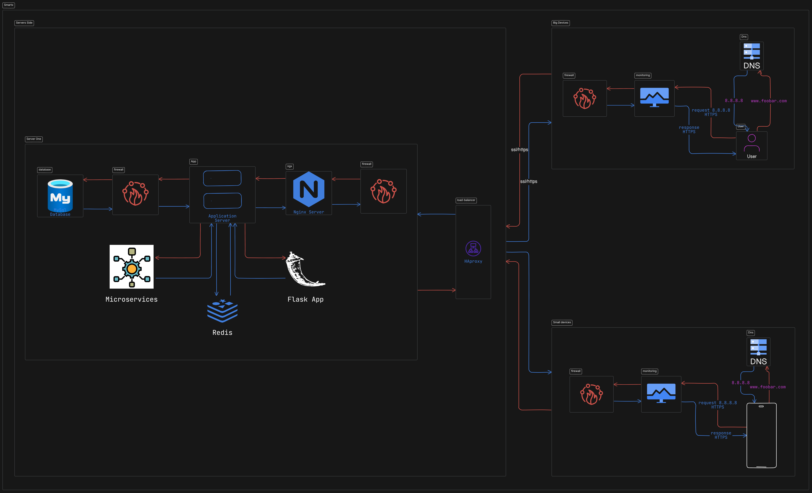

# Flask Application - Routing and API

This project is a Flask-based web application that provides a robust backend for managing users, devices, and APIs. Below is a detailed overview of the project’s features, setup instructions, and usage guidelines.

## Features

1. **User Management**:
   - Login system with session validation.
   - User profile management with details like username, email, and last login.

2. **Dashboard and Devices**:
   - Individual dashboards for devices.
   - Device information and statistics retrieval.

3. **API Support**:
   - API key validation for secure operations.
   - Endpoints for listing devices, fetching statistics, and updating values.

4. **Database Integration**:
   - Handles user and device data storage.
   - Supports dynamic data updates.

5. **Environment Configuration**:
   - Uses `.env` file for secure storage of environment variables like database credentials.

## Setup Instructions And Infrastructure

### Prerequisites

- Python 3.7+
- Flask
- pip

### Installation

1. Clone the repository:
   ```bash
   git clone <repository-url>
   cd <repository-folder>
   ```

2. Create a virtual environment and activate it:
   ```bash
   python -m venv venv
   source venv/bin/activate  # On Windows: venv\Scripts\activate
   ```

3. Install dependencies:
   ```bash
   pip install -r requirements.txt
   ```

4. Set up the `.env` file with the following variables:
   ```env
   DBUSER=<your-database-username>
   DBPASSWORD=<your-database-password>
   DBHOST=<your-database-host>
   DBNAME=<your-database-name>
   ```

5. Run the application:
   ```bash
   flask run
   ```

### Folder Structure

```plaintext
.
├── app
│   ├── __init__.py
│   ├── routes.py  # Defines routing and API logic
│   ├── database.py  # Handles database connections and queries
│   ├── models.py  # Defines data models
│   ├── users.py  # Handles user-related operations
│   ├── templates/  # HTML templates
│   └── static/  # Static files (CSS, images, JS)
├── .env  # Environment variables
├── requirements.txt  # Python dependencies
├── README.md  # Project documentation
└── run.py  # Entry point for the application
```

## API Endpoints

### User Routes

- `/` - Home page.
- `/aboutus` - About Us page.
- `/login` - User login.
- `/logout/<username>/<session>` - User logout.

### Dashboard Routes

- `/overview/<username>/<session>` - User overview page.
- `/device1/<username>/<session>` - Device dashboard.

### Profile Management

- `/profile/<username>/<session>` - User profile page.
- `/apisettings/<username>/<session>` - API settings page.

### API Routes

- `/api/<apikey>/test` - Test API connection.
- `/api/<apikey>/listdevices` - List devices associated with an API key.
- `/api/<apikey>/deviceinfo/<deviceID>` - Retrieve specific device information.
- `/api/<apikey>/fieldstat/<fieldname>` - Get field statistics across devices.
- `/api/<apikey>/devicestat/<fieldname>/<deviceID>` - Get field statistics for a specific device.
- `/api/<apikey>/update/<data>` - Update device values.

## Example Usage

1. **Login**:
   - Navigate to `/login` to authenticate.

2. **Dashboard**:
   - After login, access your dashboard at `/overview/<username>/<session>`.

3. **API Testing**:
   - Use the `/api/<apikey>/test` endpoint to verify API connectivity.

4. **Device Information**:
   - Retrieve a list of devices using `/api/<apikey>/listdevices`.
   - Get details for a specific device at `/api/<apikey>/deviceinfo/<deviceID>`.

5. **Statistics**:
   - Fetch field statistics with `/api/<apikey>/fieldstat/<fieldname>`.
   - Get device-specific statistics at `/api/<apikey>/devicestat/<fieldname>/<deviceID>`.

6. **Update Values**:
   - Use `/api/<apikey>/update/<data>` to push updates to device data.

## Contributing

1. Fork the repository.
2. Create a new branch:
   ```bash
   git checkout -b feature/your-feature-name
   ```
3. Commit changes:
   ```bash
   git commit -m "Add your message here"
   ```
4. Push to your branch:
   ```bash
   git push origin feature/your-feature-name
   ```
5. Create a pull request.

## License

This project is licensed under the [MIT License](LICENSE).
